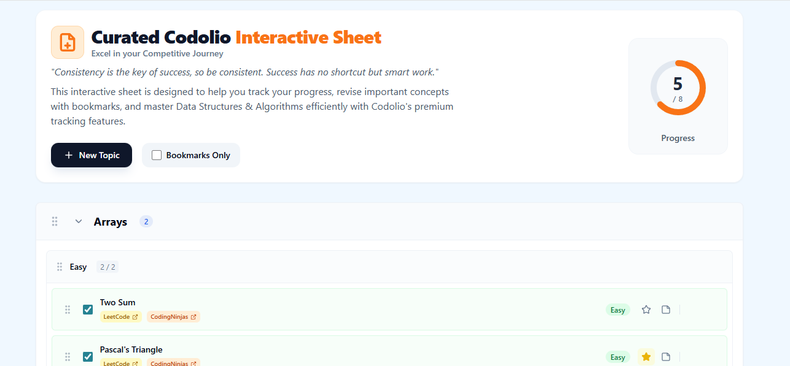

# 🚀 Interactive Question Management Sheet (Codolio) <!-- Updated -->

   

> **"Consistency is the key of success, so be consistent. Success has no shortcut but smart work."**

---

## 📸 Demo




---

## 📜 Manifesto

Data Structures and Algorithms (DSA) are the bedrock of software engineering interviews. However, tracking progress across hundreds of questions can be daunting.

**The Interactive Question Management Sheet** is built to solve this. It's not just a checklist; it's a **comprehensive learning environment**. Inspired by the Codolio platform, this tool empowers developers to:

- **Organize** their learning path hierarchically.
- **Track** their progress visually.
- **Revise** effectively with bookmarks and notes.
- **Focus** on what matters: solving problems.

---

## ✅ Functional Requirements

This project fulfills all core assignment requirements:

- [x] **Add Functionality**: Users can create Topics, Sub-topics, and Questions.
- [x] **Edit/Delete**: Full CRUD capabilities for all items.
- [x] **Hierarchical Structure**: Data organized as `Topic -> Sub-topic -> Question`.
- [x] **Drag-and-Drop Reordering**: Seamlessly reorder Topics, Sub-Topics, and Questions using `@dnd-kit`.
- [x] **Clean UI**: A responsive, intuitive single-page application.
- [x] **State Management**: Robust state handling with Zustand.

## 🌟 Bonus Features (Enhancements)

We went the extra mile to deliver a premium experience:

- [x] **Codolio Theme & Branding**: A professional Sky Blue & Orange aesthetic.
- [x] **Visual Progress Tracking**: A real-time circular progress bar in the header.
- [x] **Bookmarks System**: "Star" questions and filter by "Bookmarks Only" for revision.
- [x] **Notes Integration**: Add personal notes to any question.
- [x] **Multiple Platform Support**: Links for LeetCode, CodingNinjas, and GFG side-by-side.
- [x] **Data Persistence**: All changes are saved to `localStorage` automatically, ensuring no data loss.

---

## 🛠️ Tech Stack

- **Frontend Framework**: React.js (Vite)
- **Styling**: Tailwind CSS
- **State Management**: Zustand (Persist Middleware)
- **Drag & Drop**: @dnd-kit/core & @dnd-kit/sortable
- **Icons**: Lucide React

---

## 🏃‍♂️ Getting Started

1.  **Clone the repository**
    ```bash
    git clone https://github.com/PriyalKumar01/Interactive-Question-Management-Sheet.git
    cd Interactive-Question-Management-Sheet
    ```

2.  **Install Dependencies**
    ```bash
    npm install
    ```

3.  **Run Locally**
    ```bash
    npm run dev
    ```
    Open `http://localhost:5173` to view the app.

---

## 🤝 Contributing

Contributions are welcome! If you have ideas for new features or improvements, feel free to open an issue or submit a pull request.

---

Made with ❤️ by **Priyal Kumar**
